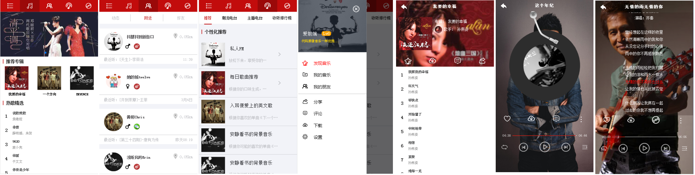

# music163-project
---
## 项目介绍
###### 本项目是学习vue的实践项目，仿制网易云音乐。作为VUE知识学习的巩固
## 技术栈
###### vue + vuex + vue-router + vue-axios + vue-awesome-swiper
## 功能实现
- [X] 音乐首页
    - [X] header导航栏切换：个人信息页、音乐首页、发现页面、电台页面、播放页面
    - [x] 轮播图
    - [x] 专辑推荐，点击专辑进入专辑详情页
        - [x] 专辑详情页点击对应歌曲进入播放页面，标识当前专辑正在播放的歌曲
    - [x] 热歌推荐，点击歌曲进入播放页面，标识正在播放歌曲
- [X] 播放页面
    - [x] 播放和暂停音乐，上一首，下一首，快进，快退
    - [x] 上一首、下一首或另一首歌曲等切歌播放界面图片更新
    - [x] 列表播放，随机播放，单曲循环
    - [x] 播放歌单列表点击显示/隐藏，点击歌曲也可以播放
    - [x] 歌曲总时长、播放当前时间，进度条同步
    - [x] 点击进度条实现快速/后退
    - [x] 歌词显示/隐藏、歌词滚动、当前歌词红色高亮
- [X] 个人页面，个人信息展示
- [X] 发现页面：半成品，完成静态页面
- [X] 电台页面：半成品，完成静态页面

###### 更新计划
1. 利用开放的网易去接口，使用fetch方式将本地数据请求更改为nodejs环境服务器请求。
1. 利用localStorge，实现用户登录和喜欢歌曲收藏功能

## 项目目录
###### 使用vue-cli 2.0版本脚手架搭建开发环境
```
|-MUSIC163-PROJECT
    |-build
    |-config
    |-node_modules
    |-src
        |-App.vue
        |-main.js
        |-components
            |-albumPage.vue
            |-swiper.vue
        |-router
            |-index.js
        |-store
            |-index.js
        |-views
            |-discover.vue
            |-music-index.vue
            |-play.vue
            |-radio.vue
            |-user.vue
    |-static
        |-css
            |- reset.css
        |-font
            |-iconfont.css
        |-img
        |-music
            |-album
            |-recommend
        |-data
            |-data.json
    |-index.html
    |-package.json
```
## 本地运行
```
git clone https://github.com/xutao0793/music163-project.git 
cd music163-project
npm install
npm run dev
在浏览器访问127.0.0.1:8080
```
###### 运行前提：客户端需要安装有nodejs npm webpack
